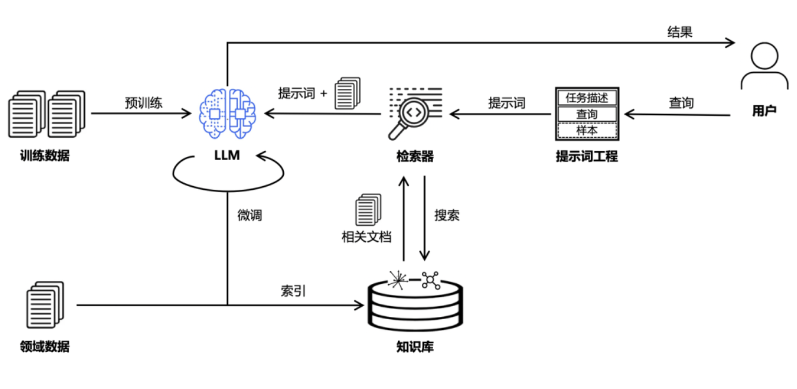

<p align="center">QSearch</p>

QSearch个人开源的 <code>LLM</code> 和 <code>RAG</code> 应用，支持本地模型和商用模型调用，整体实现方案使用高级 RAG 技术方案，主要使用召回预处理，多路召回，召回后处理，Reranker 等。



[OpenAI分享他们在RAG技术的最佳实践](https://threadreaderapp.com/thread/1796502273197314545.html?utm_campaign=topunroll)


## 应用部署

```sh
git clone https://github.com/spkywood/QSearch.git

cd QSearch

cp .env.example .env
```

### 安装中间件

```sh
cd docker

docker compose -f docker-compose.middleware.yaml up -d
```

### 数据库初始化

```sh
python3 init.py
```

### 启动服务

```sh
python startup.py
```

## 主要组件

- fastapi   Api
- milvus    向量数据库
- mysql     系统数据库
- minio     对象存储
- es        全文检索
- redis     系统缓存，对话缓存等

## 高级特性

- 上下文扩展
- 多路召回
- 查询后处理 Reranker

## TODO

- [ ] UI
- [x] Document解析
- [x] Agent：知识库 Agent，工具调用 Agent
- [ ] COT 
- [ ] 查询路由
- [ ] RAPTOR
- [x] Docker
- [x] 对话缓存


## PS 

欢迎贡献代码代码，请联系

- 邮箱：longfellow.wang@gmail.com

## 参考

- [Langchain-Chatchat](https://github.com/chatchat-space/Langchain-Chatchat)
- [Dify](https://github.com/langgenius/dify)
- [RAGflow](https://github.com/infiniflow/ragflow)
- [FastGPT](https://github.com/labring/FastGPT)
- [MaxKB](https://github.com/1Panel-dev/MaxKB)
- [AutoGen](https://microsoft.github.io/autogen)

## 学习

- [fastapi-best-practices](https://github.com/zhanymkanov/fastapi-best-practices)
- [fastapi-tips](https://github.com/Kludex/fastapi-tips)